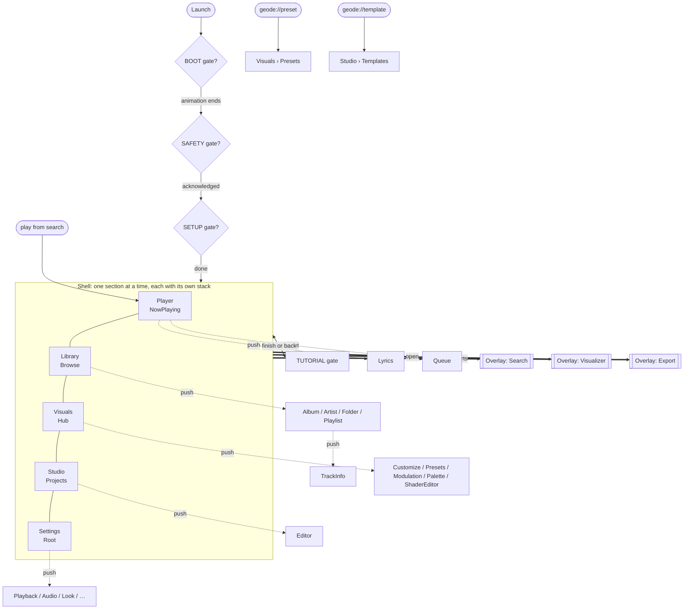

# Navigation

The flow of the app, as code: `app/src/main/java/dev/geode/nav/`. It is pure Kotlin — no
Compose, no Android except the two bridges under `nav/platform/` — so it is the contract the
new design system draws to, and it can be driven from a unit test before a single screen
exists.

The previous shell (`dev.geode.ui`: screens, view models, the liquid-glass components) was
removed in full. Nothing below is drawn yet.

## The model

| Type | What it is | Where |
|---|---|---|
| `Section` | The five top-level sections, in switcher order: Player, Library, Visuals, Studio, Settings. Each has a `root`. | `Section.kt` |
| `Destination` | Every place inside a section. Sealed by section, plus `Shared` pages any section can push. Carries its `section` and `presentation`. | `Destination.kt` |
| `Presentation` | `ROOT` (bottom of a section), `PAGE` (pushed, back pops), `SHEET` (rises over the page, back or a drag dismisses). | `Presentation.kt` |
| `Overlay` | Covers the whole shell, switcher included: `Search`, `Visualizer` (full-screen now playing), `Export` (a render in progress). | `Overlay.kt` |
| `Gate` | Stands in front of the shell: `BOOT`, `SAFETY`, `SETUP`, `TUTORIAL`. Only `TUTORIAL` answers to back. | `Gate.kt` |
| `NavState` | One immutable snapshot: the current section, a stack per section, the overlays, the gate. | `NavState.kt` |
| `Navigator` | Holds the `NavState`, moves it, narrates each move, follows predictive back, routes deep links. | `Navigator.kt` |
| `NavMove` | What just changed: kind, from-state, to-state, the touch origin if known, whether a gesture drove it. | `NavMove.kt` |
| `Routes` / `NavSaver` | The string form of every destination and of a whole state, for restore after process death. | `Routes.kt`, `NavSaver.kt` |
| `DeepLink` | `geode://preset/…`, `geode://template/…`, Android Auto play-from-search. | `DeepLink.kt` |

Every section keeps its own stack, so leaving Library on an album and coming back lands on
that album. Overlays stack in the order opened over whichever section is current. At most one
gate is up.

## Destinations

| Section | Root | Pages | Sheets |
|---|---|---|---|
| Player | `NowPlaying` | `Lyrics` | `Queue`, `SleepTimer` |
| Library | `Browse(view)` — `TRACKS`, `ALBUMS`, `ARTISTS`, `FOLDERS`, `PLAYLISTS`, `FAVOURITES`, `RECENT` | `Album(name)`, `Artist(name)`, `Folder(path)`, `Playlist(id)`, `SmartPlaylist(id?)`, `Duplicates` | — |
| Visuals | `Hub` | `Customize`, `Presets`, `Modulation`, `Palette`, `ShaderEditor` | `Background`, `Layers` |
| Studio | `Projects` | `Editor(projectId)` | `Templates`, `LoopRender` |
| Settings | `Root` | `Playback`, `Audio`, `Look`, `Behavior`, `Folders`, `ExternalAudio`, `AutoVisuals`, `Export`, `Help`, `About` | — |
| Shared (any section) | — | `TrackInfo(uri)` | `AddToPlaylist(uri)` |

Going to a root replaces its section's stack (that is how the Library view changes). Going
to a destination in another section switches there first. Pushing what is already on top does
nothing.

## The flow

## Back

`Navigator.back()` does the first of these that applies and returns true; when none applies it
returns false and the activity lets the system finish, which leaves the app:

1. A dismissible gate is up → take it down.
2. An overlay is up → close the top one.
3. The current section has a page or sheet over its root → pop it.
4. The current section is not Player → switch to Player.

Predictive back is the same decision, previewed: `backStarted` publishes a `BackGesture` whose
`target` is exactly the state `back()` would produce, `backProgressed` follows the finger, and
the eventual `back()` is flagged `gesture = true` in its `NavMove` so the transition continues
from wherever the surfaces already are. `nav/platform/BackBinding.kt` wires all of this to the
activity's `OnBackPressedDispatcher`, enabled exactly while `NavState.canGoBack`.

## Deep links

`DeepLink.parse(action, data, query)` recognises the three ways in. `Navigator.handle` moves to
the surface that deals with each — Visuals › Presets, Studio › Templates, Player — and keeps
the link in `pendingLink` until the importer or player calls `consumeLink`. `MainActivity`
blanks the intent after routing so a resume cannot replay it.

## Restore

`NavSaver.encode` writes a state as lines of `key=value` with each stack as a comma-separated
list of routes; `decode` reads it back. Everything is named, never numbered, so reordering an
enum or a sealed class cannot land someone on the wrong page; an unknown route is dropped, and a
stack that lost its root gets it back. `MainActivity` does this in `onSaveInstanceState`.

## Connectors: where the design system plugs in

`nav/connect/` holds the seams. None of them is called by the navigation layer; each is a
contract the design system implements and the shell hands it. `NavConnectors` bundles them,
and `NavConnectors.none()` is a shell with nothing attached.

| Seam | Type | Carries | Default |
|---|---|---|---|
| Motion policy | `StateFlow<MotionPolicy>` | `reducedMotion`, `intensity` (0–1) | full motion |
| Transitions | `TransitionConnector` → `Transition` | kind (`PAGE`, `SHEET`, `SECTION`, `OVERLAY`, `GATE`, `NONE`), direction, the touch `origin`, `gesture` | `DefaultTransitions`: pages forward/back, sheets up/down, sections slide toward the chosen one, overlays and gates rise and fall; everything `NONE` under reduced motion |
| Touch | `TouchFeedback` | `TouchEvent`: `PRESS`, `HOLD`, `DRAG`, `RELEASE`, `CANCEL`, position, delta, elapsed | `TouchFeedback.None` |
| Gravity | `GravitySource` | `StateFlow<Gravity>` in m/s², device frame, with `start`/`stop` | `GravitySource.None` (at rest); `SensorGravitySource` reads the fused gravity sensor or the accelerometer |
| Haptics | `HapticConnector` | `HapticCue`: `TAP`, `HOLD`, `SECTION`, `PAGE`, `SHEET`, `DISMISS`, `CONFIRM`, `REJECT` | `HapticConnector.None` |

Ripples, ink, glow, stretch, drift, a water field, a particle layer — anything that reacts to
a touch — sits behind `TouchFeedback`; the design system's touch modifier feeds it and
whatever simulation it keeps listens. Anything that sinks, tilts or flows reads `GravitySource`.
Every `Navigator` call that a tap starts takes an optional `origin: Point`, which travels in the
`NavMove` and the `Transition` so a surface can expand from the element that was tapped.

### Attaching

`MainActivity` (`dev.geode.MainActivity`) creates the `Navigator` and the `NavConnectors`,
binds back and deep links, starts and stops the gravity source with its lifecycle, and saves
and restores the state. It has no `setContent`. The design system adds one, taking
`navigator` and `connectors`, and:

- collects `navigator.state` to decide what to draw, and `navigator.moves` (through
  `connectors.transition(move)`) to decide how it moves;
- collects `navigator.backGesture` to move surfaces with a predictive-back drag;
- calls `navigator.go` / `show` / `open` / `close` / `back` from its controls, passing the
  touch origin;
- replaces `TouchFeedback.None` and `HapticConnector.None` with its own, and swaps
  `DefaultTransitions` if it wants a different choreography;
- raises and clears gates from the preferences that decide them (boot animation on, safety
  acknowledged, setup done, tutorial seen), which the navigation layer deliberately does not
  read.

## Not decided here

These belonged to the removed shell and are the design system's to place: which sections a
person sees (the old shell hid Studio for listeners); the mini player and where it sits; the
second-screen and picture-in-picture behaviour of the visualizer; the two-pane layout on wide
windows; which surface hosts export, tag editing and the crash report. Nothing in `nav/`
prevents any of them.
